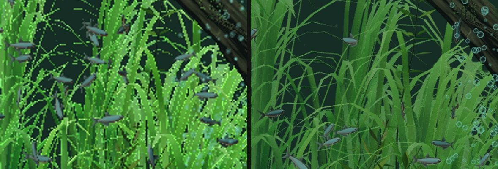

# Aqua Clock Web

**Where the fish tell the time.** A planted freshwater tank that runs in your browser.
Eighty-four neon tetras drift, feed and shy from your cursor, then, every minute, gather
into the hour. Two clownfish keep house in an anemone. No install, no account.

> ### Built on Desktop Habitats
> The tank itself (the substrate, stones, driftwood, moss, planting, and the way light
> is absorbed by the water) is **[Desktop Habitats](https://github.com/chaseleantj/desktop-habitats)**
> by Chase Lean, a live wallpaper and screen saver for macOS. It is MIT licensed, and
> seven of its modules are vendored here, with every change marked
> ([details](src/scene/riverscape/NOTICE.md)). **If what you want is an aquarium screen
> saver for your Mac, go to Habitats.** It is a beautiful piece of work and this project
> would not exist without it. What this repo adds is a clock, a pair of clownfish, glassy
> bubbles, and a way to run the whole thing on any screen that has a browser.
> Not affiliated with, or endorsed by, Habitats.

## Also an iPhone and iPad app

**[Aqua Clock on the App Store](https://apps.apple.com/gb/app/aqua-clock/id6760460959)**
· [Aqua-Clock_Info](https://github.com/digitalurban/Aqua-Clock_Info), the app's site.

The app and this page tell the time the same way, but they are different builds. The app
is a native 2D scene made to sit on a nightstand all night. This is a 3D scene rendered
live in the browser: more realistic, nothing to install, and heavier. Leaving that much
GPU work running all night on a phone is the reason it is not simply *in* the app; see
[docs/DEVICE-TESTING.md](docs/DEVICE-TESTING.md).

## Try it

**Live:** <!-- add the GitHub Pages address here once Pages is switched on -->

- **Show the time** gathers the shoal into the hour straight away (otherwise it does it
  for the first fifteen seconds of every minute).
- **Feed the fish** drops food. The neons and the clownfish go for it.
- **Full screen** hides every word and the darkening overlay. Move or tap and three icons
  (time, feed, exit) appear for three seconds.

| | |
| --- | --- |
| `#full` or `?view=full` | start in the full screen view (a nightstand bookmark) |
| `?quality=lite` / `?quality=rich` | force a profile. Touch screens and small machines get `lite` by default |
| `?fog=grey` | stock grey fog instead of the per-channel water fog, for comparison |
| `F` / `Esc` | enter / leave full screen |

On iPhone, Safari has no Fullscreen API, so the view hides the text but keeps the address
bar. For none at all: open it with `#full`, then Share, Add to Home Screen.

## What is in the tank

- **The clock.** 84 neons take positions on a seven-segment layout, three to a segment.
  The mechanism is ported from [city-clock](https://github.com/digitalurban/city-clock).
  Fish not needed for the current digits are sent to the back of the tank and keep swimming.
  Held upright, a phone gets the digits stacked, hours over minutes.
- **Clownfish.** An *Amphiprion ocellaris* pair on a host anemone. They hover, dart, turn
  by pivoting, nose into the tentacles and shimmy, take the occasional lap of the tank,
  dash for food, and bolt for cover if the cursor comes close. Motion is
  acceleration-limited, and nothing ever moves a fish by assigning its position.
- **Bubbles.** Glassy sprites (bright rim, specular glint, dark hairline edge) rather than
  dots: a plume from a half-buried air stone that widens and grows as it rises, micro-bubbles
  thrown by the pump, and the odd bubble pearling off a leaf.
- **Water.** Per-channel fog, so distance turns the tank green-teal rather than grey;
  and Habitats' own light model for everything under it.
- **Two profiles.** `rich` is Riverscape as published. `lite` drops the shadow pass and
  thins the planting, for phones and older tablets. Both are always multisampled: the
  plants use alpha-to-coverage, which without MSAA breaks up into flickering dots.

There is deliberately **no moving light**: no caustics, light shafts or surface shimmer.

## Building

The page is one self-contained HTML file. To rebuild it from the source in `src/scene`:

    python3 build.py index.html index.html      # the built page is its own template

It needs no packages. three.js (0.169.0) is loaded from jsDelivr by an import map, and the
Inter font from Google Fonts, so the page needs a network connection.

    src/scene/riverscape.js     the scene: shoal, clock, clownfish, pump, air stone
    src/scene/bubbles.js        the bubble system
    src/scene/riverscape/       Habitats' modules (vendored) + lod.js
    src/scene/textures.js       Poly Haven CC0 maps, inlined
    tools/                      real-browser tests; see tools/README.md
    docs/                       build notes, device testing, six months of models

## How this was built, and what six months changed

The iOS app was built about six months ago. This web version was built recently, in one
long conversation with one assistant that could, by the end, run the page in a real
browser and measure it. The difference in *how* the work got checked turned out to matter
more than the difference in code, and this repo keeps the tests so the comparison can be
made again.

**[docs/SIX-MONTHS.md](docs/SIX-MONTHS.md)** has the then-and-now, the bugs that only
measurement found (with numbers), and a protocol for re-running the same project with a
newer model.

## Status, honestly

Checked in a real headless Chromium on software WebGL2 (the lite profile): behaviour, the
clock, layout at several screen shapes, the bubbles, the full screen view. **Not checked:**
Safari or any Apple GPU, frame rate, heat or battery on a real phone, and the `rich`
profile in a browser (it crashes the capture tool). Test on your own device before
trusting it; [docs/DEVICE-TESTING.md](docs/DEVICE-TESTING.md) says how.

## Credits and licences

| | | |
| --- | --- | --- |
| **Desktop Habitats** (Riverscape) | Chase Lean | MIT |
| **city-clock** (the clock mechanism) | digitalurban | this author's own |
| **Poly Haven** textures | Rock Boulder Dry, Rough Wood, Sand 01 | CC0 |
| **three.js** | three.js authors | MIT |
| **Inter** (typeface) | Rasmus Andersson | SIL OFL, from Google Fonts |

The code in this repo is MIT ([LICENSE](LICENSE)). Full notices in
[THIRD-PARTY.md](THIRD-PARTY.md).
