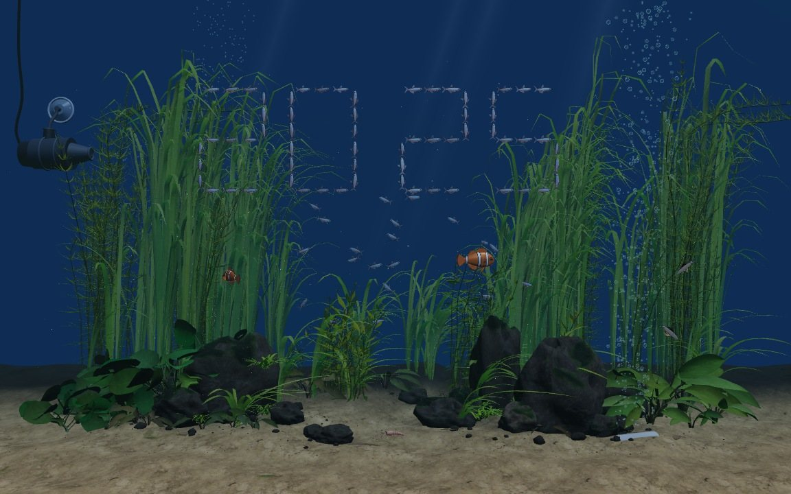
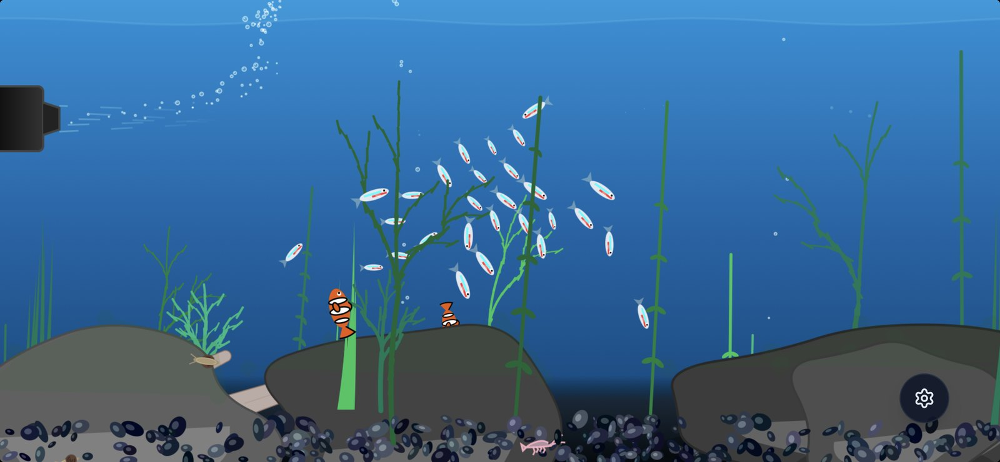
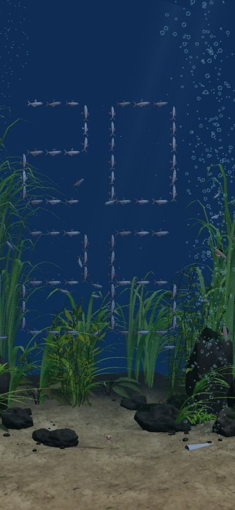
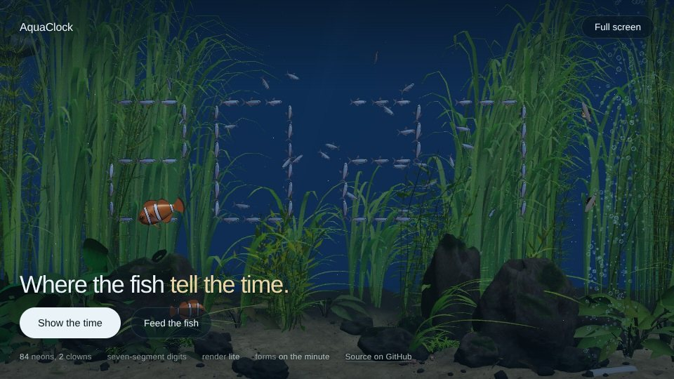

# Aqua Clock Web

**Where the fish tell the time.** A planted freshwater tank that runs in your browser.
Eighty-four neon tetras drift, feed and shy from your cursor, then, every minute, gather
to tell the time. 

### ▶ [View it via: digitalurban.org/Aqua_Clock_Web](https://digitalurban.org/Aqua_Clock_Web/)

## The story

**Aqua Clock** launched on the [App Store](https://apps.apple.com/gb/app/aqua-clock/id6760460959) in March 2026: a tank where the fish tell
the time. It was built to be lightweight and battery friendly - see the post written up at Digital Urban
[*Multi-Model Vibe Coding, Boids, and the Fish That Tell the Time*](https://connected-environments.org/blog/2026-03-20-aqua-clock-vibe-coding-boids-fish-tell-time/).

Six months on, we came across [**Desktop Habitats**](https://github.com/chaseleantj/desktop-habitats), Chase Lean's amazing open-source
(MIT) live aquarium wallpaper for macOS, whose tank is photoreal: a very different world from
Aqua Clock's flat 2D scene. As such the draw to update our time-telling aquarium was strong and we pointed Claude's latest model at the Habitats repository. It read the Habitats code, brought
the tank in (with credit, see below), and built the clock, the clownfish, the bubbles and
their behaviour on top. This repo is the result: a new, web-based Aqua Clock that runs in
any browser.

<table>
<tr>
<td width="50%"> <b>March 2026, the app</b> (screenshot from <a href="https://connected-environments.org/blog/2026-03-20-aqua-clock-vibe-coding-boids-fish-tell-time/">the post</a>). 2D, HTML5 Canvas, 28 tetras, a 10.5 MB iOS app. Built with Claude and Gemini AI Studio.</td>
<td width="50%"> <b>September 2026, this web version.</b> 3D, WebGL2, 84 tetras and two clownfish, one page of about 550 kB. Built with Claude Sonnet 5.5.</td>
</tr>
</table>

> ### Built on Desktop Habitats
> This project stands on **[Desktop Habitats](https://github.com/chaseleantj/desktop-habitats)**
> by Chase Lean, a live aquarium wallpaper for macOS. It is MIT licensed. **If what
> you want is a live aquarium on your Mac desktop, go to Habitats.** It is a beautiful
> piece of work and this project would not exist without it. Exactly how much of it is used,
> in three tiers:
>
> - **Copied.** The code that builds the tank: substrate, stones, moss, planting and the way
>   the water absorbs light. Seven of its modules are vendored here, two byte-for-byte and the
>   rest with a handful of marked changes ([which, and why](src/scene/riverscape/NOTICE.md)).
>   Its ten stones, its plant species and its moss and algae systems are all still in the tank.
> - **Changed.** The composition and the colour, using that code. There is no driftwood:
>   Habitats' trunk is a diagonal across the middle of the tank, where the clock sits, so this
>   tank is stones and planting instead. Six of the stones are our own (among them a tall
>   upright stone behind the main stone, with two companions), with a stand of stem plants,
>   rosettes and ferns around them. The planting is re-planned, with the right bed the heavier
>   and the middle-back thinned to leave open water behind the clock. And the water is a clear
>   aquarium blue: Habitats' light lets green through furthest, ours lets blue. The light
>   moving over the sand is Habitats' own focusing, restored at a softer strength that the
>   page sets, and its sand is made wider, to suit the wider lens.
> - **Adapted.** How light passes through a fish's skin: the constants and formula in
>   `src/scene/riverscape.js` are taken from its `fish-anatomy.js`.
> - **Ours, inspired by it.** The fish bodies (a neon tetra and a clownfish, built the way
>   Habitats builds its bloodfin tetra, lofted cross-sections in fractions of body length, but
>   with our own proportions) and everything above the tank: the clock, the clownfish
>   behaviour, the bubbles, the fog, the air stone, the pump, the snails, the shrimp, the light
>   through the day and the page.
>
> What this repo adds is our previous concept of fish telling the time, a pair of clownfish, glassy bubbles, and a hosted web page tuned for phones and tablets. Not affiliated with, or endorsed by, Habitats or Chase Lean.

## The app

**[Aqua Clock on the App Store](https://apps.apple.com/gb/app/aqua-clock/id6760460959)** · [Aqua-Clock_Info](https://github.com/digitalurban/Aqua-Clock_Info), the app's site.

The app and this page tell the time the same way, but they are different builds. The app is
a native 2D scene made to sit on a nightstand all night. This is a 3D scene rendered live in
the browser: more realistic, nothing to install, and heavier. Leaving that much GPU work
running all night on a phone is the reason it is not simply *in* the app; see
[docs/DEVICE-TESTING.md](docs/DEVICE-TESTING.md).

## Try it

**Live: [https://digitalurban.org/Aqua_Clock_Web/](https://digitalurban.org/Aqua_Clock_Web/)**

- **Show the time** gathers the shoal into the hour straight away (otherwise it does it
  for the first fifteen seconds of every minute).
- **Feed the fish** drops food. The neons and the clownfish go for it.
- **Full screen** hides every word and the darkening overlay. Move or tap and four icons
  (time, feed, light, exit) appear for three seconds.

| | |
| --- | --- |
| `#full` or `?view=full` | start in the full screen view (a nightstand bookmark) |
| `?quality=lite` / `?quality=rich` | force a profile. Touch screens and small machines get `lite` by default |
| `?fog=grey` | stock grey fog instead of the per-channel water fog, for comparison |
| `F` / `Esc` | enter / leave full screen |
| `L`, or the sun icon in full screen | the next look for the light: the device's clock (the default), dawn, day, dusk, night, then a fixed evening look |
| `?light=day` (or `dusk`, `night`, `dawn`, `evening`, `19:30`, `clock`) | open at one look or a time of day; the default follows the device's clock |
| `?surface=on` | add a rippled underside of the water's surface at the top of a wide picture (off by default) |

On iPhone, Safari has no Fullscreen API, so the view hides the text but keeps the address
bar. For none at all: open it with `#full`, then Share, Add to Home Screen.

## What is in the tank

- **The clock.** 84 neons take positions on a seven-segment layout, three to a segment. The
  page tells the scene how much room its words leave, and the clock lays itself out in the
  space above them, so it never sits behind the text; in full screen view it is centred.
  The mechanism is ported from [city-clock](https://github.com/digitalurban/city-clock).
  Fish not needed for the current digits are sent to the back of the tank and keep swimming.
  Held upright, a phone gets the digits stacked, hours over minutes.
- **Clownfish.** An *Amphiprion ocellaris* pair that keep to a patch of the tank in front of the
  left-hand stones. They hover, dart, turn by pivoting, nose down at the stones and shimmy,
  take the occasional lap of the tank,
  dash for food, and bolt for cover if the cursor comes close. Motion is
  acceleration-limited, and nothing ever moves a fish by assigning its position.
- **Bubbles.** Glassy sprites (bright rim, specular glint, dark hairline edge) rather than
  dots: a plume from a half-buried air stone that widens and grows as it rises, micro-bubbles
  thrown by the pump, and the odd bubble pearling off a leaf.
- **Snails.** Two snails crawl slowly over the front glass, down the right-hand side, clear of
  the clock and the words. As on a real tank's glass, you see the pale foot against the glass
  with the head and tentacles at the front and the shell on its back, behind it. They pause,
  and sometimes draw back under the shell, shut it with their horny plate, and ease out again.
  They came from the original app.
- **Shrimp.** Two ghost shrimp live on the sand in the front of the tank. They scuttle and pick at
  the sand with their front claws, groom their antennae, climb onto the low stones and sit there,
  swim up into the water to a new spot, and now and then flick their tails to shoot backward.
- **Water.** Per-channel fog, so distance turns the tank blue-teal rather than grey;
  and Habitats' own light model for everything under it.
- **Light.** Faint beams of light come down through the water, and soft light moves over the
  sand and the stones. By default it follows the device's clock: bright by day, dim and blue at
  night. The sun button in the full screen view (or `L`) runs the light on to dawn, day, dusk,
  night or a fixed evening look, and back to the clock.
- **Two profiles.** `rich` is Riverscape as published. `lite` drops the shadow pass and
  thins the planting, for phones and older tablets. Both are always multisampled: the
  plants use alpha-to-coverage, which without MSAA breaks up into flickering dots.

## Building

The page is one self-contained HTML file. To rebuild it from the source in `src/scene`:

    python3 build.py index.html index.html      # the built page is its own template

It needs no packages. three.js (0.169.0) is loaded from jsDelivr by an import map, and the
Inter font from Google Fonts, so the page needs a network connection.

    src/scene/riverscape.js     the scene: shoal, clock, clownfish, pump, air stone
    src/scene/bubbles.js        the bubble system
    src/scene/snails.js         the snails
    src/scene/shrimp.js         the shrimp
    src/scene/daylight.js       the light through the day
    src/scene/surface.js        the beams of light (and an optional rippled water surface)
    src/scene/riverscape/       Habitats' modules (vendored) + lod.js
    src/scene/textures.js       Poly Haven CC0 maps, inlined
    tools/                      real-browser tests; see tools/README.md
    docs/                       build notes, device testing, six months of models

## Credits and licences

| | | |
| --- | --- | --- |
| **Desktop Habitats** (Riverscape) | Chase Lean | MIT |
| **city-clock** (the clock mechanism) | digitalurban | this author's own |
| **Poly Haven** textures | Rock Boulder Dry, Rough Wood, Sand 01 | CC0 |
| **three.js** | three.js authors | MIT |
| **Inter** (typeface) | Rasmus Andersson | SIL OFL, from Google Fonts |
| **Claude Sonnet 5.5** | Anthropic | built this web version with the author |

The code in this repo is MIT ([LICENSE](LICENSE)). Full notices in
[THIRD-PARTY.md](THIRD-PARTY.md).
